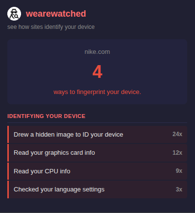

# wearewatched

> See how websites secretly identify your device.

Websites can identify your device without storing anything. They read your graphics card, count your CPU cores, check your language settings, probe your audio hardware — and combine it all into a unique fingerprint. No cookies required. No consent asked. wearewatched intercepts these API calls in real time and shows you exactly what each site is doing — in plain language, not developer jargon.

Everything runs locally. No data leaves your browser.

## What it detects

### Device fingerprinting
| What you see | What it means | Why it matters |
|---|---|---|
| Drew a hidden image to ID your device | The site draws an invisible picture and reads how your device rendered it — tiny differences in your GPU and drivers make the result unique to you | Acts as a device ID that survives incognito, cookie clearing, and VPNs |
| Read your graphics card info | Reads your GPU brand, model, and driver version | Narrows your identity — only so many people have your exact card |
| Used audio to fingerprint your device | Plays a silent sound and measures how your hardware processes it | Like the canvas trick but with audio — another unique signal to stack |
| Read your CPU info | Reads how many processor cores your device has | Adds to the fingerprint — combined with other signals, helps single you out |
| Checked your language settings | Reads your full list of preferred languages | Shrinks the pool — "English + Arabic + French" is rarer than just "English" |

### Permission access
| What you see | What it means | Why it matters |
|---|---|---|
| Tried to read your clipboard | The site attempted to read whatever you last copied | Could capture passwords, addresses, or private text without you knowing |
| Requested your location | Asked for your GPS coordinates | Knows exactly where you are, not just your approximate city |
| Tracking your location | Continuously monitoring your position in real time | Following your movement, not just a one-time check |
| Asked to send you notifications | Requested permission to push notifications to your device | Often used to spam ads disguised as system alerts |

## Try It Now

Store approval pending — install locally in under a minute:

### Chrome
1. Download this repo (Code → Download ZIP) and unzip
2. Go to `chrome://extensions` and turn on **Developer mode** (top right)
3. Click **Load unpacked** → select the `chrome-extension` folder
4. That's it — browse any site and click the extension icon

### Firefox
1. Download this repo (Code → Download ZIP) and unzip
2. Go to `about:debugging#/runtime/this-firefox`
3. Click **Load Temporary Add-on** → pick any file in the `firefox-extension` folder
4. That's it — browse any site and click the extension icon

> Firefox temporary add-ons reset when you close the browser — just re-load next session.

---

## The weare____ Suite

Privacy tools that show what's happening — no cloud, no accounts, nothing leaves your browser.

| Extension | What it exposes |
|-----------|----------------|
| [wearecooked](https://github.com/hamr0/wearecooked) | Cookies, tracking pixels, and beacons |
| [wearebaked](https://github.com/hamr0/wearebaked) | Network requests, third-party scripts, and data brokers |
| [weareleaking](https://github.com/hamr0/weareleaking) | localStorage and sessionStorage tracking data |
| [wearelinked](https://github.com/hamr0/wearelinked) | Redirect chains and tracking parameters in links |
| **wearewatched** | Browser fingerprinting and silent permission access |
| [weareplayed](https://github.com/hamr0/weareplayed) | Dark patterns: fake urgency, confirm-shaming, pre-checked boxes |
| [wearetosed](https://github.com/hamr0/wearetosed) | Toxic clauses in privacy policies and terms of service |
| [wearesilent](https://github.com/hamr0/wearesilent) | Form input exfiltration before you click submit |

All extensions run entirely on your device and work on Chrome and Firefox.
